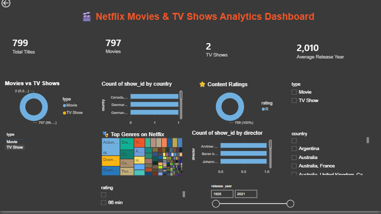

# 🎬 Netflix Movies & TV Shows Analytics Dashboard

## 📌 Project Overview

This project presents an interactive Power BI dashboard built using the Netflix Movies & TV Shows dataset. The dashboard provides insights into content distribution, genres, ratings, release trends, and more using Power BI, Power Query, and DAX.

---

## 📊 Dashboard Features

- Total Titles KPI
- Movies vs TV Shows Analysis
- Genre Distribution
- Rating Distribution
- Release Year Trend
- Interactive Slicers
- Top Directors

---

## 🛠 Tools Used

- Microsoft Power BI
- Power Query
- DAX
- CSV Dataset

---

## 📷 Dashboard Preview

---

## 📂 Dataset

Netflix Movies and TV Shows Dataset (Kaggle)

---

## 🚀 Skills Demonstrated

- Data Cleaning
- Data Modeling
- DAX Calculations
- Dashboard Design
- Data Visualization

---

## 👩‍💻 Author

**Anu**
